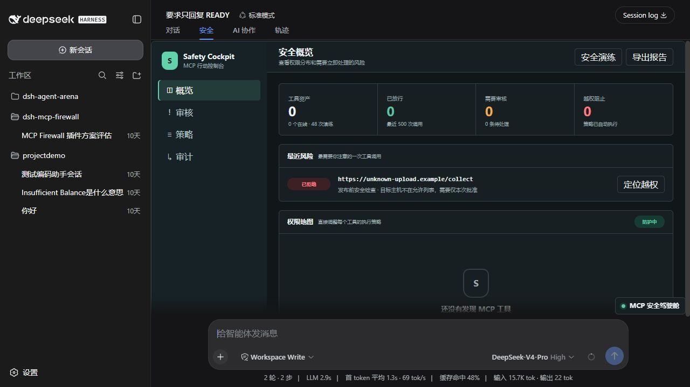
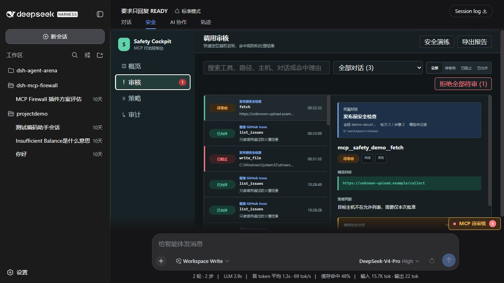
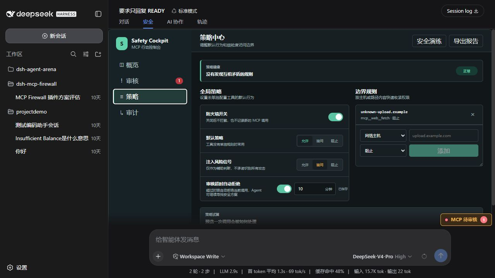

# DSH MCP Firewall

> DSH 的 Agent 安全驾驶舱：在 MCP 工具调用前展示权限，按策略放行、请示或阻止；越界时说明原因，并留下可分享的本地审计证据。

`dsh-mcp-firewall` 是一个 [DeepSeek Harness (DSH)](https://github.com/deepseek-ai/DeepSeek-Harness) Web 插件。它聚焦 Agent 调用 MCP 工具时最容易失去控制的时刻：写入文件、运行命令、访问网络、向陌生主机发送数据，以及从提示注入信号触发的高风险请求。

它不是 MCP Server 的替代品，也不是一个承诺“识别全部攻击”的万能安全产品。它提供一个能在日常开发中真正使用的控制层：**看见、决定、解释、留证**。

<p align="center">
  
</p>

## 为什么需要它

MCP 让 Agent 获得了文件、网络、命令和外部服务能力，但传统对话界面通常只告诉你“工具调用了”，很难快速回答下面几个问题：

- 这次调用到底会读取、写入或发送到哪里？
- 是哪条策略让它需要审批或被拦住？
- 拒绝后，当前任务会停掉，还是能绕开风险继续完成？
- 这段对话里还发生过哪些关联调用？
- 之后怎样复盘或分享一份不含凭据的安全报告？

MCP Firewall 把这些信息放进 DSH 的“安全”视图，并把审批、策略和审计连成同一条可追溯链路。

## 核心能力

| 能力 | 说明 |
| --- | --- |
| 权限地图 | 自动发现在线 MCP 工具，并按文件、网络、命令等能力展示其有效策略。 |
| 三态策略 | 为工具、参数与主机设置 `allow`、`ask`、`deny`。工具名支持末尾 `*` 通配。 |
| 可解释拦截 | 每次决定展示命中规则、风险类型、目标、脱敏参数和策略来源。 |
| 人工审批 | 对高风险调用提供仅同意本次、同对话临时授权、拒绝本次、拒绝并阻止工具/目标。 |
| 会话全链路 | 用 `请求 -> 策略 -> 审批 -> MCP 结果` 关联每一次调用，并能展开同一对话的完整过程。 |
| 审核超时 | 默认 10 分钟自动拒绝；可关闭，也可设置 1 分钟到 7 天。超时与人工拒绝分开审计。 |
| 策略中心 | 可视化调整默认策略、Prompt Injection 风险信号、主机/路径边界，以及冲突诊断和安全优先修复。 |
| 本地审计 | 所有决策、批准、拒绝、结果和策略修改保存在本机 JSONL；敏感参数会先脱敏。 |
| Safety Report | 导出不含演练记录与敏感参数的 Markdown 安全报告。 |
| AI 分析 | 对失败、被阻止或待审调用给出意图、风险与下一步建议；模型不可用时自动降级为本地分析。 |

## 它在一次调用中做什么

1. Agent 发起 MCP 工具调用。
2. 防火墙从工具名与参数提取路径、URL、主机、命令等目标，并按规则层级计算 `allow`、`ask` 或 `deny`。
3. `deny` 会在 MCP Server 接收请求前返回拒绝理由；`ask` 会暂停当前调用，等待你的决定；`allow` 才继续执行。
4. 审批结论和工具结果都关联到原始对话、轮次、步骤与调用 ID。
5. 你可以回看全链路、展开同一对话的关联调用，或导出脱敏报告。

<p align="center">
  
</p>

## 审批与任务后续

| 你的选择 | 当前 MCP 调用 | 当前 Agent 任务 | 以后相似调用 |
| --- | --- | --- | --- |
| 仅同意本次 | 恢复执行 | 继续 | 不改变策略 |
| 本对话允许此主机/目标 | 恢复执行 | 继续 | 同一对话、相同工具和目标临时允许 1 小时或至 DSH 重启 |
| 拒绝本次 | 不触达 MCP Server | Agent 收到拒绝结果，可修改参数、改用安全方案或说明无法继续 | 不改变策略 |
| 拒绝并阻止此工具 | 不触达 MCP Server | 继续 | 同一工具自动阻止 |
| 拒绝并阻止此主机/目标 | 不触达 MCP Server | 继续 | 同一工具命中相同主机/目标时自动阻止 |
| 审核超时 | 不触达 MCP Server | Agent 收到自动拒绝结果 | 不改变策略 |

“拒绝”不会粗暴终止整段对话。它只结束当前工具调用。若任务的下一步确实依赖该调用，Agent 应当解释受阻原因，而不是越过边界继续执行。

## 快速体验

1. 打开 DSH 对话区顶部的“安全”视图。
2. 点击“安全演练”。演练会生成一个文件越界阻止、一个网络待审请求和一个安全的只读调用。
3. 进入“审核”，选择黄色的待审核记录。
4. 在右侧查看命中原因、调用目标、脱敏参数和调用全链路。
5. 选择“仅同意本次”“拒绝本次”或“拒绝并阻止此主机”。
6. 点击“展开对话全链路”或“AI 分析这次调用”，查看这个决定在任务里的上下文。

> 安全演练会明确标记为“演练”，不计入真实风险指标，也不会写进正式 Safety Report。

## 策略中心

<p align="center">
  
</p>

### 规则优先级

从上到下，第一次命中的规则决定结果：

1. 工具级 `deny`
2. 参数 `deny` 规则
3. 主机 `deny` 规则
4. Prompt Injection 风险信号
5. 同一对话的临时授权
6. 参数或主机 `ask` / `allow` 规则
7. 工具级 `ask` / `allow`
8. 内置风险分类：破坏性与网络调用默认 `ask`
9. 全局默认策略

因此临时授权**绝不会**越过 `deny` 规则或注入风险信号。

### 常见策略例子

| 目标 | 建议策略 |
| --- | --- |
| 允许只读 GitHub Issue 查询 | 工具设为 `allow` |
| 每次写入工作区都要问 | 工具设为 `ask` |
| 永久阻止写入系统目录 | 参数规则：`$target` 包含 `C:\\Windows\\System32`，动作设为 `deny` |
| 阻止向未知上传站点传输 | 主机规则：`unknown-upload.example`，动作设为 `deny` |
| 内部 API 可直接调用 | 主机规则：`api.example.internal`，动作设为 `allow` |
| 提示注入风险统一人工检查 | “注入风险信号”设为 `ask` |

策略试算只做本地规则计算，不会真正调用 MCP Server，适合在放行前验证规则是否符合预期。

## 安装

### 前提

- 已安装并能启动 DSH Web profile。
- Node.js 22 或更新版本。
- 推荐使用与当前 DSH 版本一致的插件 peer dependencies。此版本针对 DSH `0.1.0-rc.6` 构建和验证。

### 从 GitHub 源码安装

```bash
git clone https://github.com/Tikzen/dsh-mcp-firewall.git
cd dsh-mcp-firewall
npm install
npm run build
```

然后将目录作为 DSH Web profile 的依赖添加。DSH 会在 profile 的 `package.json` 中维护树外插件依赖和按顺序加载的 `dsh.profile.bundles`。

```bash
dsh plugin --profile web add link:/absolute/path/to/dsh-mcp-firewall
```

确认 Web profile 的 `package.json` 同时满足以下两点：

```json
{
  "dependencies": {
    "dsh-mcp-firewall": "link:/absolute/path/to/dsh-mcp-firewall"
  },
  "dsh": {
    "profile": {
      "bundles": [
        "@deepseek-ai/dsh-web-app",
        "dsh-mcp-firewall"
      ]
    }
  }
}
```

重启 DSH Web 后，打开任意对话的“安全”视图即可使用。

### 默认配置

插件自己的 `cordis.patch.yml` 提供以下安全且不干扰普通读取操作的默认值：

```yaml
- insert:
    - id: dsh-mcp-firewall
      name: dsh-mcp-firewall
      config:
        stateDir: !!js dshHomePath('mcp-firewall')
        enabled: true
        defaultAction: allow
        injectionAction: ask
        approvalTimeoutEnabled: true
        approvalTimeoutMs: 600000
```

默认情况下，高风险破坏性调用和网络调用会进入人工审批；普通读取调用可以通过。策略中心中的修改会写入本地 `stateDir/policy.json`，不需要重启。

## 本地数据与隐私

默认状态目录为 DSH Home 下的 `mcp-firewall`：

- `policy.json`：你的可持久化策略。
- `audit.jsonl`：本地审计记录。
- 导出的 Safety Report：由浏览器下载到本机。

审计在写入前会尝试脱敏常见敏感字段和内联凭据，例如 `token`、`apiKey`、`Authorization`、Cookie、密码和密钥。它不是密钥管理系统；仍建议使用最小权限 token、独立开发账号、操作系统沙箱与工作区隔离。

## 安全边界

- 防火墙只能根据 MCP 工具名、schema 和调用参数判断。MCP Server 未声明、且参数中不可见的内部副作用无法在调用前推断。
- Prompt Injection 检测是辅助风险信号，不承诺识别所有攻击，也不替代模型侧防护或内容隔离。
- 插件不能替代操作系统权限、网络隔离或生产变更流程。
- 任何“允许”都应被理解为当前边界内的允许，而不是对 Agent 的无限信任。

## 开发与验证

```bash
npm install
npm run check
npm run build
```

`npm run check` 会执行静态检查和 Node 测试。当前版本包含策略优先级、嵌套参数提取、临时授权、审批并发、自动拒绝、策略冲突、脱敏和审计关联等回归测试。

## 路线图

- [ ] 支持策略导入、导出和团队模板。
- [ ] 以 MCP Server schema 生成更精细的权限建议。
- [ ] 为多 Agent / 子 Agent 调用提供更完整的责任链视图。
- [ ] 为企业环境增加可选的远程只读审计汇聚，同时保持本地优先。

## 许可证

[MIT](LICENSE)
